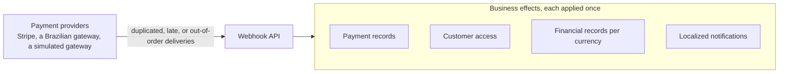

# AWS resilient payment flow

[](https://developer.hashicorp.com/terraform)
[](https://www.typescriptlang.org/)
[](https://nodejs.org/)
[](https://esbuild.github.io/)
[](https://vitest.dev/)
[](https://aws.amazon.com/lambda/)
[](https://aws.amazon.com/api-gateway/)
[](https://aws.amazon.com/serverless/sam/)
[](https://aws.amazon.com/dynamodb/)
[](https://aws.amazon.com/sdk-for-javascript/)
[](https://www.docker.com/)
[](https://github.com/gabrielroriz/aws-resilient-payment-flow/actions/workflows/ci.yml)

> [!IMPORTANT]
> **Under development.** Only the build and deployment foundation works so far; the payment flow below is the goal, not yet the current behavior. See [Current state](#current-state).

Subscription payments reach this platform as webhooks from external payment providers. This project is building the AWS backend that will turn those webhooks into correct, auditable business outcomes (payment records, customer access, financial records, and notifications) across several gateways, currencies, and countries. Simulated providers, load tests, and failure scenarios will demonstrate the results.

## The challenge

Webhook delivery is unreliable, but the business outcomes must not be. Each event can change money and customer access, so a mistake can grant access without payment, credit a customer twice, or lose a refund.



| What can go wrong | What the system must guarantee |
|---|---|
| A provider delivers the same event twice, or retries after a slow acknowledgment | Each business effect happens once |
| A refund arrives before the payment it refunds | The final state is correct, and an older event never reverses a newer outcome |
| Processing stops halfway, for example after granting access but before notifying the customer | Recovery completes the remaining steps without repeating finished ones |
| Gateways differ in authentication, event names, payload shapes, and amount formats | Equivalent events follow the same business rules, and adding a gateway does not change them |
| One gateway fails or sends a traffic burst | The other gateways keep processing |
| A defect mishandles events, or a provider event never arrives | Operators can trace each event, safely reprocess the affected ones, and detect missing events from provider history |

Success is measurable: a webhook acknowledgment p99 below one second under the declared load, no acknowledged event lost, zero duplicate business effects, and automatic recovery from a two-hour downstream outage. The [requirements](docs/REQUIREMENTS.md) define the full scope, including currencies, country pricing, localization, and the acceptance scenarios.

## Current state

`npm run deploy` builds the TypeScript Lambdas and deploys them with Terraform behind an API Gateway HTTP API. Besides a health check, a [webhook receipt function](docs/webhooks.md) accepts `POST /webhooks/{provider}`: the provider adapter named in the URL authenticates the request and reads its event, which is stored once in the [webhook events table](docs/data-model/webhook-events.md) for deduplication and tracing. No provider adapter exists yet, so every provider is rejected for now. Event processing and the gateway integrations are not implemented yet.

## Architecture

The project follows a hexagonal (ports and adapters) architecture with dependency injection. See [Architecture](docs/architecture.md) for details.

## Get started

Use Node.js 24 and npm. From the repository root:

```bash
npm ci
npm run build
npm test
```

Each registered Lambda builds to `dist/bundles/<function-name>/index.js`.

To run the HTTP endpoints locally against DynamoDB Local, complete the [SAM and Docker setup](docs/development.md#run-locally), then run `npm run dev`.

To deploy, follow the [AWS and Terraform setup](docs/deployment.md), then run:

```bash
npm run deploy
```

This command automatically applies the Terraform plan and outputs each Lambda's HTTP endpoint. See [Calling the API](docs/deployment.md#calling-the-api) for endpoint details.

## Documentation

- [Development](docs/development.md): local setup, DynamoDB Local, and builds.
- [Testing](docs/testing.md): running tests, test layout, and how to write new tests.
- [Architecture](docs/architecture.md): hexagonal model, layers, ports, dependency injection, and error handling.
- [Receiving webhooks](docs/webhooks.md): the webhook route, its responses, and adding a payment provider.
- [Webhook events table](docs/data-model/webhook-events.md): DynamoDB access patterns, keys, items, and indexes for received webhooks.
- [Adding a Lambda](docs/adding-a-lambda.md): creating a function and configuring its route.
- [Deployment](docs/deployment.md): requirements, setup, and the AWS deployment workflow.
- [Requirements](docs/REQUIREMENTS.md): project scope and acceptance criteria.
- [TODO](TODO.md): deferred work.
