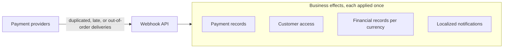
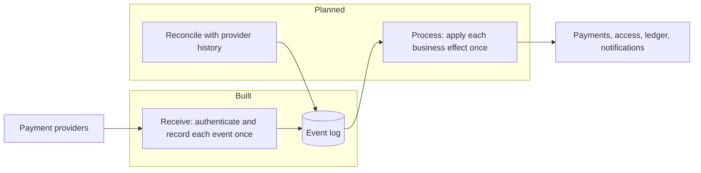

# AWS resilient payment flow

> [!IMPORTANT]
> **Under development.** Webhooks are already received, authenticated, and recorded exactly once; turning them into business effects is not built yet. See [Progress](#progress).

Subscription payments reach this platform as webhooks from external payment providers. This project builds the AWS backend that turns those webhooks into correct, auditable business outcomes (payment records, customer access, financial records, and notifications) across several gateways, currencies, and countries, and demonstrates them with simulated providers, failure scenarios, and load tests.

## The problem

Webhook delivery is unreliable, but the business outcomes must not be. Each event can move money or change customer access, so a mistake can grant access without payment, credit a customer twice, or lose a refund.

| What can go wrong | What the system must guarantee |
|---|---|
| A provider delivers the same event twice, or retries after a slow acknowledgment | Each business effect happens once |
| A refund arrives before the payment it refunds | The final state is correct, and an older event never reverses a newer outcome |
| Processing stops halfway, for example after granting access but before notifying the customer | Recovery completes the remaining steps without repeating finished ones |
| Gateways differ in authentication, event names, payload shapes, and amount formats | Equivalent events follow the same business rules, and adding a gateway does not change them |
| One gateway fails or sends a traffic burst | The other gateways keep processing |
| A defect mishandles events, or a provider event never arrives | Operators can trace each event, safely reprocess the affected ones, and detect missing events from provider history |

Success is measurable: a webhook acknowledgment p99 below one second under the declared load, no acknowledged event lost, zero duplicate business effects, and automatic recovery from a two-hour downstream outage. The [requirements](docs/requirements.md) define the full scope, including currencies, country pricing, localization, and the acceptance scenarios.

## The approach

The design separates receiving an event from acting on it, and makes every step safe to repeat.

| Principle | How it addresses the problem | Status |
|---|---|---|
| Record before acknowledging | Each webhook is authenticated and stored once, keyed by its provider and event ID, before the provider gets a response. A repeated delivery is recognized and recorded instead of stored again, and no acknowledged event is lost. | Built |
| Translate at the edge | An adapter per provider absorbs its authentication, vocabulary, and formats, so the rest of the system sees one event model and a new gateway changes no business rule. | Built |
| Keep the full history | Each event keeps its exact payload and every repeated delivery, and will keep its processing attempts and business effects, so operators can trace and safely reprocess it. | Partly built |
| Act after acknowledging | Business effects run separately from receipt, so acknowledgments stay fast and a slow dependency never makes providers retry. | Planned |
| Make every effect idempotent | Each business effect carries a key that identifies it, so retries, recovery, and reprocessing never repeat a completed one. | Planned |
| Follow the order events happened | Events about the same payment or subscription are applied in the order the provider says they occurred, so a late event cannot reverse a newer outcome. | Planned |
| Prove it by simulation | Simulated gateways with different formats deliver events in the patterns of the acceptance scenarios, against a local or deployed environment. | Built for receipt |

## Progress

| Milestone | Status | What it covers |
|---|---|---|
| Build and deployment foundation | Done | Reproducible provisioning with Terraform, and builds and tests in CI |
| Local environment | Done | Running the API, its database, and the simulator from the same infrastructure definitions, without deploying |
| Webhook receipt | Done | At receipt: duplicate delivery, provider retry, overlapping gateway identifiers, forged requests, and malformed events |
| Simulated gateways and delivery simulator | Done | Replaying those scenarios against a local or deployed API |
| Event processing and business effects | Planned | Out-of-order delivery, partial failure, and downstream outage |
| Recovery, reprocessing, and reconciliation | Planned | Defect recovery and missing events |
| Real gateways in test environments | Planned | Equivalent events from real gateways following the same business rules |
| Currencies, country pricing, and localization | Planned | Currency precision, historical reporting, and localized notifications |
| Load, monitoring, and cost | Planned | Traffic bursts, gateway disruption, and cost per million events |

## Getting started

Use Node.js 24 and npm, then install the dependencies with `npm ci`. Local runs and deployment need further tools, listed in each guide.

| To | Run | Guide |
|---|---|---|
| Build and test | `npm run build && npm test` | [Testing](docs/guides/testing.md) |
| Run the API locally | `npm run dev` | [Development](docs/guides/development.md) |
| Replay the delivery scenarios | `npm run simulate` | [Simulated gateways](docs/guides/simulated-gateways.md) |
| Deploy to AWS | `npm run deploy` | [Deployment](docs/guides/deployment.md) |

## Documentation

- [Requirements](docs/requirements.md): the problem, scope, quality targets, and acceptance scenarios.
- **Architecture**: how the system is built.
  - [Code structure](docs/architecture/code-structure.md): hexagonal layers, dependency injection, configuration, and errors.
  - [Webhook receipt](docs/architecture/webhook-receipt.md): how webhooks are authenticated, recorded, and answered.
  - [Data model](docs/architecture/data-model/): access patterns, keys, and items of each DynamoDB table.
- **Guides**: how to work on the project.
  - [Development](docs/guides/development.md): running the API and its database locally.
  - [Testing](docs/guides/testing.md): running and writing automated tests.
  - [Deployment](docs/guides/deployment.md): deploying to AWS and calling the API.
  - [Simulated gateways](docs/guides/simulated-gateways.md): the test gateways and the delivery simulator.
  - [Adding a Lambda](docs/guides/adding-a-lambda.md): creating a function, its route, permissions, and environment variables.
  - [Adding a provider](docs/guides/adding-a-provider.md): supporting a new payment gateway.
- [TODO](TODO.md): deferred work.
