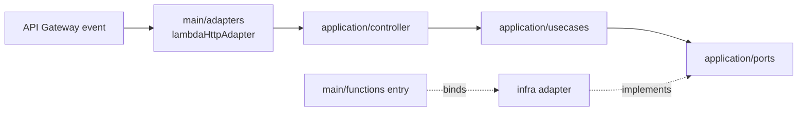

# Architecture

Lambda code follows a hexagonal (ports and adapters) structure with dependency injection. Business logic depends only on ports it defines; AWS services, providers, and the Lambda runtime are adapters at the edges. See [Adding a Lambda](adding-a-lambda.md) for the step-by-step workflow.

## Layers

| Directory | Contains | May import |
|---|---|---|
| `src/application/` | Use cases, controllers, ports, contracts, and errors | `application`, `kernel` |
| `src/infra/` | Driven adapters that implement ports | `application`, `kernel` |
| `src/main/` | Driving adapters for Lambda events and one entry file per function | Any layer |
| `src/kernel/` | Dependency injection registry and decorator | `kernel` |

Imports use the `tsconfig.json` path aliases `@application/*`, `@infra/*`, `@kernel/*`, and `@main/*`. The import rules are not enforced by tooling; keep `infra` and `main` imports out of `application` during review.

| Path | Responsibility |
|---|---|
| `application/usecases/<area>/` | One business operation per class; depends on ports and other application code |
| `application/ports/` | Abstract classes describing what the core needs from outside, such as time, storage, or providers |
| `application/controller/<area>/` | Turns a transport-neutral `Controller.Request` into a use case call and a `Controller.Response` |
| `application/contracts/` | Shapes shared across layers, such as the `Controller` contract |
| `application/errors/` | Error codes and the base classes mapped to responses |
| `infra/<concern>/` | Adapter classes implementing ports |
| `main/adapters/` | Converts Lambda events into controller calls and maps results and errors to responses |
| `main/functions/` | One entry per Lambda: binds ports to adapters and exports `handler` |

## How a request flows



The [health function](../src/main/functions/health.ts) is the reference example: `GetHealthController` calls `GetHealthUseCase`, which reads the time through the `Clock` port implemented by `SystemClock`.

## Dependency injection

Classes register themselves with `@Injectable`, listing their constructor dependencies in order. TypeScript rejects a list that does not match the constructor, so a mismatch fails `npm run build`. The list is explicit because esbuild does not emit TypeScript decorator metadata.

```ts
@Injectable(Clock)
export class GetHealthUseCase {
  constructor(private readonly clock: Clock) {}
}
```

Ports are abstract classes rather than interfaces, so they exist at runtime and can serve as tokens. Each function's entry file is its composition root:

```ts
const registry = Registry.getInstance();
registry.bind(Clock, SystemClock);

export const handler = lambdaHttpAdapter(registry.resolve(GetHealthController));
```

| Behavior | Detail |
|---|---|
| When the graph is built | Once, when the module loads in a new execution environment |
| Instance scope | One shared instance per class for the environment's lifetime; keep per-request state out of injected classes |
| Binding location | In each function's entry, so its bundle includes only the adapters it uses |
| Missing binding | `resolve` throws `No provider for <Port>` during initialization |

## Errors

[`lambdaHttpAdapter`](../src/main/adapters/lambdaHttpAdapter.ts) parses JSON request bodies and returns JSON responses. Errors become `{ "success": false, "error": { "code", "message" } }`:

| Thrown | Use for | Response |
|---|---|---|
| `ApplicationError` subclass | Expected business failures from use cases | Its `statusCode` (default `400`), code, and message |
| `HttpError` subclass, such as `BadRequest` | Invalid requests, such as a malformed JSON body | Its `statusCode`, code, and message |
| Anything else | Unexpected failures | `500` with `INTERNAL_SERVER_ERROR`; details only in logs |

Add new codes to [`ErrorCode`](../src/application/errors/ErrorCode.ts). Every error is logged as one JSON line with the request ID, route, and error kind; stacks are logged only for unexpected errors.
