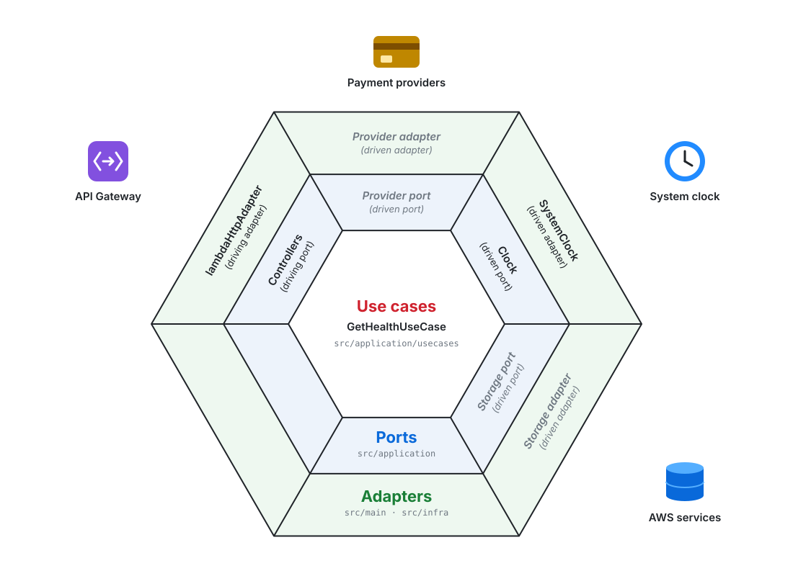
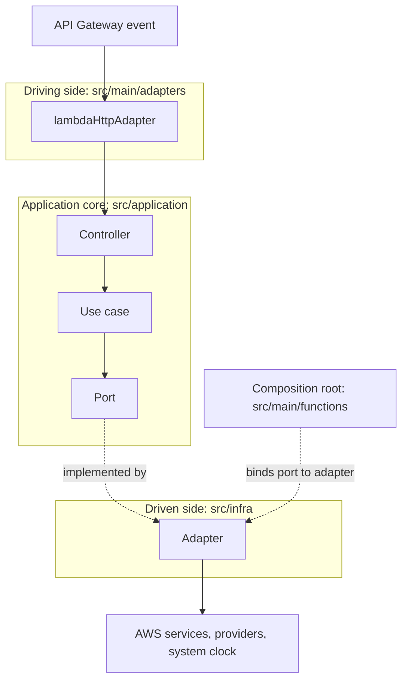
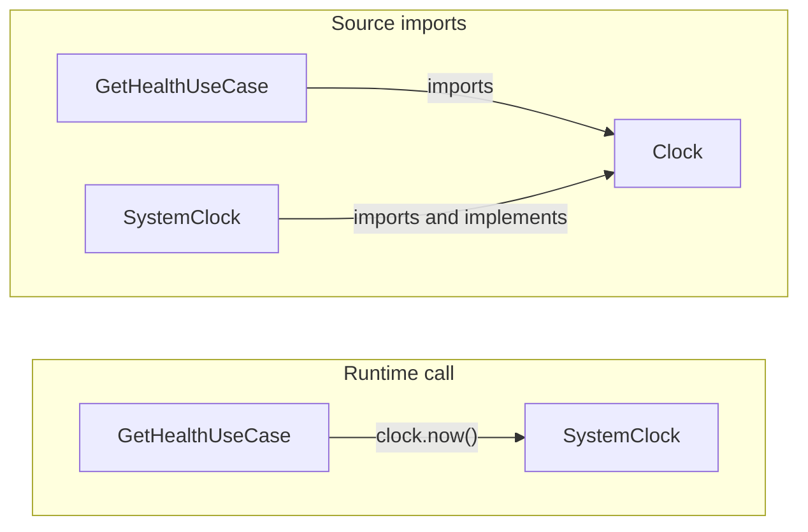
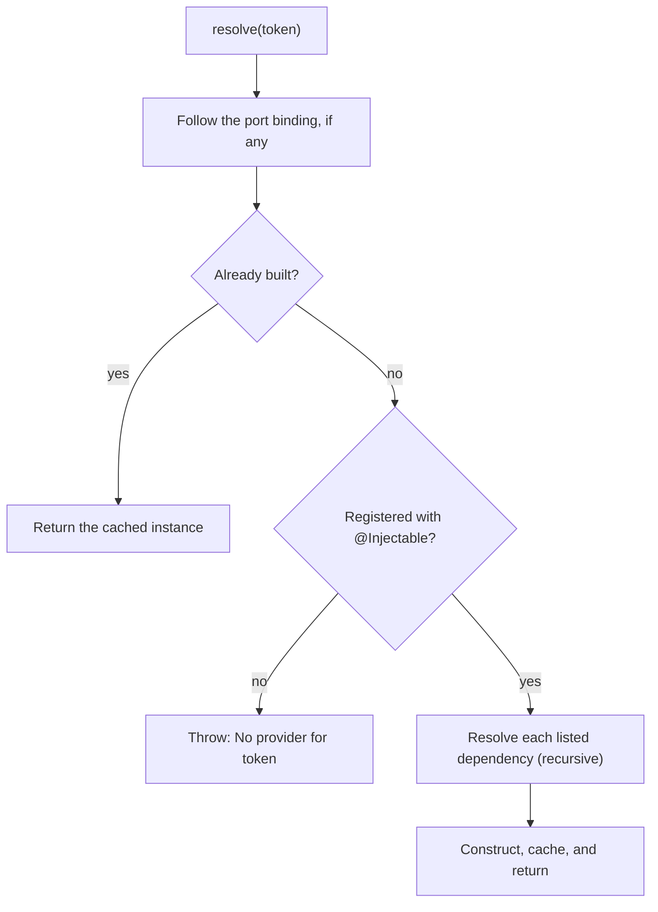

# Architecture

Lambda code follows a hexagonal (ports and adapters) structure with dependency injection. Business logic depends only on ports it defines; AWS services, providers, and the Lambda runtime are adapters at the edges. See [Adding a Lambda](adding-a-lambda.md) for the step-by-step workflow.

## Hexagonal model

Driving adapters turn platform events into calls on the core. Whenever the core needs something from outside, it calls a port, and a driven adapter implements that port. Each function's entry file is its composition root: it decides which adapter backs each port.



The two inner rings live in `src/application`; the outer ring is split between `src/main/adapters` on the driving side and `src/infra` on the driven side. `lambdaHttpAdapter` calls controllers through the `Controller` contract, which makes that contract the driving port; the abstract classes in `application/ports/` are the driven ports. Gray italic segments are examples of port categories rather than existing classes.

A request travels from the platform event through the core to the outside world:



The [health function](../src/main/functions/health.ts) is the reference example: `GetHealthController` calls `GetHealthUseCase`, which reads the time through the `Clock` port implemented by `SystemClock`.

## Layers

| Directory | Contains | May import |
|---|---|---|
| `src/application/` | Use cases, controllers, ports, contracts, and errors | `application`, `kernel` |
| `src/infra/` | Driven adapters that implement ports | `application`, `kernel` |
| `src/main/` | Driving adapters for Lambda events and one entry file per function | Any layer |
| `src/kernel/` | Dependency injection registry and decorator | `kernel` |

Imports use the `tsconfig.json` path aliases `@application/*`, `@infra/*`, `@kernel/*`, and `@main/*`. The import rules are not enforced by tooling; keep `infra` and `main` imports out of `application` during review.

| Path | Responsibility |
|---|---|
| `application/usecases/<area>/` | One business operation per class; depends on ports and other application code |
| `application/ports/` | Abstract classes describing what the core needs from outside, such as time, storage, or providers |
| `application/controller/<area>/` | Turns a transport-neutral `Controller.Request` into a use case call and a `Controller.Response` |
| `application/contracts/` | Shapes shared across layers, such as the `Controller` contract |
| `application/errors/` | Error codes and the base classes mapped to responses |
| `infra/<concern>/` | Adapter classes implementing ports, grouped by concern, such as `infra/clock/` or `infra/repositories/<entity>/` |
| `infra/<service>/` | Shared clients and helpers for one external service, such as `infra/dynamodb/`; they implement no port and are reused by adapters |
| `main/adapters/` | Converts Lambda events into controller calls and maps results and errors to responses |
| `main/utils/` | Helpers shared by driving adapters, such as parsing request bodies and building responses |
| `main/functions/` | One entry per Lambda: binds ports to adapters and exports `handler` |

## Dependency direction

Calls flow outward at runtime, but source imports point inward: `infra` imports the ports it implements, and `application` never imports `infra`. This is the Dependency Inversion Principle.



Classes never construct their own dependencies; the composition root and the registry build and supply them. This inversion of control is what lets an entry swap one adapter for another without touching the core.

## Ports and contracts

A driven port is a contract only: an abstract class with abstract members that describes what the core needs, in the core's terms. [`Clock`](../src/application/ports/Clock.ts) is the reference.

| Rule | Reason |
|---|---|
| Use an abstract class, not an interface | Abstract members are erased, but the class remains at runtime as the DI token |
| Declare only abstract members; put related types in a namespace of the same name | Adapters use `implements`, which inherits nothing, so concrete members would never reach them |
| Name operations by what the core needs, such as `now()` | Vendor operations and SDK types tie the core to one provider |
| Keep each port to one concern | Small ports are easier to fake in tests and to implement per provider |

Use cases receive ports through their constructors, so a unit test can pass a fake directly, such as `new GetHealthUseCase(fixedClock)`, without the registry.

`application/contracts/` holds a different kind of contract:

| | `application/ports/` | `application/contracts/` |
|---|---|---|
| Describes | What the core needs from outside | Shapes shared across layers, such as `Controller` |
| Form | Abstract class | Interface or type |
| Implemented by | Adapters in `src/infra/` | Application code, such as controllers |
| Used as a DI token | Yes, through a binding | No |

## Types that belong to a class

Declare the types a class owns, such as its inputs, outputs, and the shapes it stores, in an exported namespace with the same name, placed after the class. Callers then write `GetHealthUseCase.Output`, so every use names the owning class and needs no extra import.

```ts
export class GetHealthUseCase {
  async execute(): Promise<GetHealthUseCase.Output> {
    // ...
  }
}

export namespace GetHealthUseCase {
  export type Output = { status: "ok"; checkedAt: string };
}
```

| Type | Where it goes |
|---|---|
| Owned by one class, including shapes only that class uses | The class's namespace |
| Shared across layers, such as the `Controller` request and response | `application/contracts/` |
| Helper for a standalone function or decorator | Module level, next to the function |

## Dependency injection

Classes register themselves with `@Injectable`, listing their constructor dependencies in order. TypeScript rejects a list that does not match the constructor, so a mismatch fails `npm run build`. esbuild compiles the project's standard decorators but cannot emit constructor type metadata, so the explicit list replaces it.

```ts
@Injectable(Clock)
export class GetHealthUseCase {
  constructor(private readonly clock: Clock) {}
}
```

### Concrete classes and ports

A dependency is either a concrete class, which resolves directly, or a port, which needs a binding. Make a dependency a port when the core needs it from outside, or when it may change per provider, environment, or test.

| Dependency | Example | Wiring |
|---|---|---|
| Core to core | `GetHealthController` → `GetHealthUseCase` | Concrete class; no binding |
| Infra to infra | A repository adapter → the shared DynamoDB client wrapper | Concrete class; no binding |
| Core to outside | `GetHealthUseCase` → `Clock` | Port bound to an adapter in the entry file |
| Core to infra adapter | A use case importing `SystemClock` | Not allowed; add a port |

### Composition root

Each function's entry file binds its ports, then resolves its controller:

```ts
const registry = Registry.getInstance();
registry.bind(Clock, SystemClock);

export const handler = lambdaHttpAdapter(registry.resolve(GetHealthController));
```

`resolve` builds the graph depth first and caches every instance:



| Behavior | Detail |
|---|---|
| When the graph is built | Once, when the module loads in a new execution environment |
| Instance scope | One shared instance per class for the environment's lifetime, so clients and their connections are reused across invocations; keep per-request state out of injected classes |
| Binding location | In each function's entry, so its bundle includes only the adapters it uses |
| Missing binding | `resolve` throws `No provider for <Port>` during initialization |
| Circular import | `@Injectable` throws `<Class> dependency #<n> is undefined` when the module loads |

### Binding several ports

An entry binds one port per line, and only the ports its graph reaches, so its bindings list every external dependency of the function. When the same group repeats across functions, move it into a function under `src/main/` and call it from each entry, for example:

```ts
export function bindBillingStorage(registry: Registry): void {
  registry.bind(PaymentRepository, DynamoPaymentRepository);
  registry.bind(SubscriptionRepository, DynamoSubscriptionRepository);
}
```

Keep each group to adapters that every caller uses; anything extra is bundled into functions that never call it.

| Avoid | Why |
|---|---|
| One global bootstrap that binds every port | Every bundle includes every adapter and its SDK clients |
| Adapters registering themselves as a port's default | Bindings depend on import order, and two adapters for one port overwrite each other silently |

A missing binding fails only when the entry loads. [`build/bundle.test.mts`](../build/bundle.test.mts) loads every registered entry from its production bundle, so `npm test` catches it.

## Errors

[`lambdaHttpAdapter`](../src/main/adapters/lambdaHttpAdapter.ts) parses JSON request bodies and returns JSON responses. Errors become `{ "success": false, "error": { "code", "message" } }`:

| Thrown | Use for | Response |
|---|---|---|
| `ApplicationError` subclass | Expected business failures from use cases | Its `statusCode` (default `400`), code, and message |
| `HttpError` subclass, such as `BadRequest` | Invalid requests, such as a malformed JSON body | Its `statusCode`, code, and message |
| Anything else | Unexpected failures | `500` with `INTERNAL_SERVER_ERROR`; details only in logs |

Add new codes to [`ErrorCode`](../src/application/errors/ErrorCode.ts). Every error is logged as one JSON line with the request ID, route, and error kind; stacks are logged only for unexpected errors.
