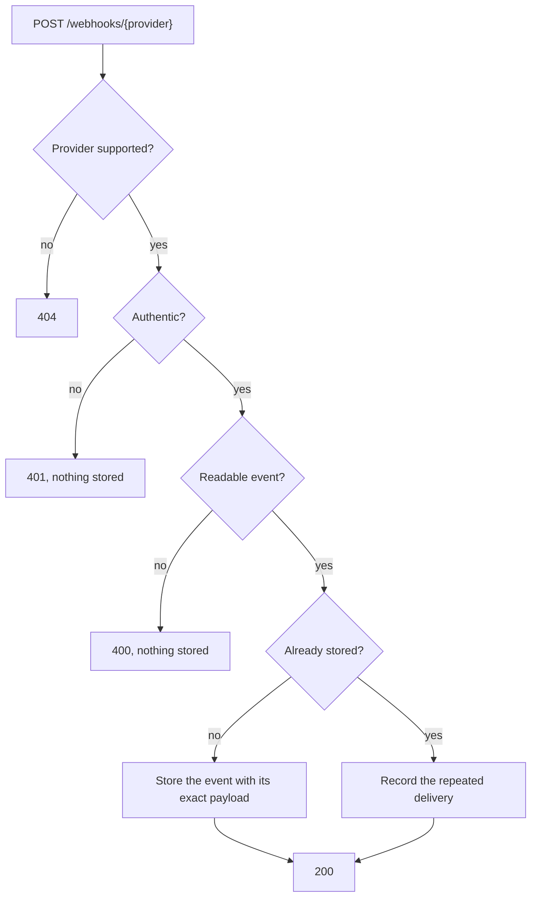

# Webhook receipt

Every payment provider delivers its webhooks to one route, `POST /webhooks/{provider}`, served by one function. The provider named in the path authenticates the request and reads its event through its adapter, and the event is recorded once, with its exact payload, in the [webhook events table](data-model/webhook-events.md). Receipt applies no business effects, so it acknowledges quickly.

## How it works

- The path segment selects the provider adapter with exactly that name.
- Nothing from an unauthenticated request is parsed or stored.
- The stored event keeps the body exactly as received, so it can be audited and reprocessed.
- A repeated delivery is acknowledged like a new one, because providers retry until they receive a 2xx response, and is recorded with the stored event.
- Events are keyed by provider and event ID, so providers that reuse each other's IDs never collide.

## Responses

| Status | Error code | Category | Kind | When |
|---|---|---|---|---|
| 200 | | | | The event was stored, or a repeated delivery was recorded; the body is `{ "provider", "providerEventId", "duplicate" }` |
| 400 | `BAD_REQUEST` | `http` | Expected | The body is not valid JSON |
| 400 | `MALFORMED_WEBHOOK_EVENT` | `webhooks` | Unexpected | The request is authentic, but its body is not an event the provider sends, so its adapter likely needs updating |
| 401 | `WEBHOOK_AUTHENTICATION_FAILED` | `webhooks` | Expected | The request does not prove it comes from the provider in its path |
| 404 | `WEBHOOK_PROVIDER_NOT_FOUND` | `webhooks` | Expected | The path names a provider this deployment does not support |
| 500 | `INTERNAL_SERVER_ERROR` | | Unexpected | A failure the application does not define, such as storage being unavailable or provider credentials missing; the provider retries |

Errors use the response shape and log fields described in [Errors](code-structure.md#errors). An expected error can still signal trouble in volume: a sudden rise in `WEBHOOK_AUTHENTICATION_FAILED` may mean a rotated credential rather than forged requests.

## Provider adapters

Each supported provider has an adapter that implements the `WebhookProvider` port, and the provider catalog finds it by the name in the path.

| Adapter member | Responsibility |
|---|---|
| `name` | The provider's path segment, also recorded with each of its events |
| `authenticate` | Proves the request comes from the provider, checking its signature or credentials against the body exactly as received |
| `parse` | Reads the event ID, event type, occurrence time, and affected payment or subscription, or reports that the body is not one of the provider's events |

Providers differ in authentication, vocabulary, and payload formats; their adapters absorb those differences, so the rest of the system sees one event model. See [Adding a provider](../guides/adding-a-provider.md), and [Simulated gateways](../guides/simulated-gateways.md) for two providers with deliberately different shapes.

## Limitations

- Bodies must be JSON; other formats are rejected with 400 before reaching the provider adapter.
- Every provider's credentials are validated together, so one missing credential answers every provider's webhooks with 500 until it is configured.
