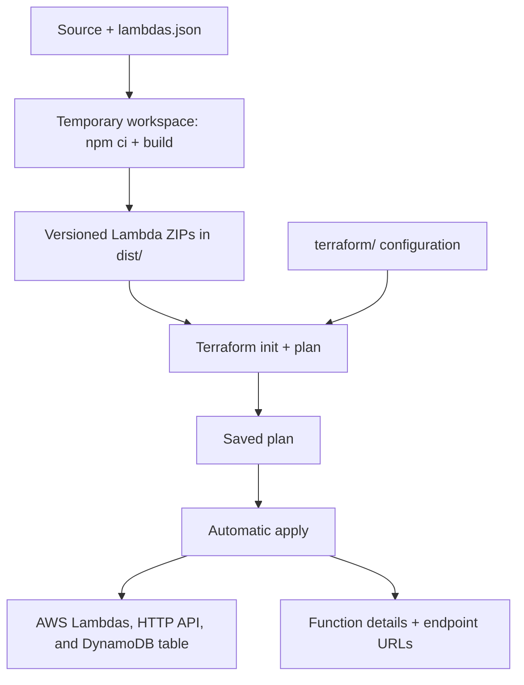

# Deployment

Build and deploy all registered Lambdas, their HTTP API, and the DynamoDB table to AWS. See [Development](development.md) for local execution and [Testing](testing.md) for automated checks.

## Requirements

| Requirement | Used for |
|---|---|
| Node.js 24 and npm | Installing build tools and compiling handlers |
| Bash and `zip` | Running the deployment script and packaging functions |
| Terraform matching [the project constraint](../terraform/terraform.tf) | Planning and applying infrastructure changes |
| AWS credentials and network access | Accessing the state backend and managing AWS resources |
| Existing S3 backend bucket | Storing Terraform state |

## Setup

1. Install the tools above and configure credentials for the target AWS account.
2. Review the backend bucket, state key, provider region, and resource names in [`terraform/terraform.tf`](../terraform/terraform.tf).
3. Ensure the backend bucket exists before initialization. The configuration also manages this bucket, so an existing bucket must be tracked in this Terraform state before applying.

## How deployment works

[`scripts/deploy.sh`](../scripts/deploy.sh) builds in a temporary directory and uses [`lambdas.json`](../lambdas.json) to select the functions.



**The script automatically applies the entire saved plan**, including infrastructure changes beyond Lambda code. It does not pause for review or run the test suite.

| Artifact | Behavior |
|---|---|
| `dist/<name>_<version>.zip` | One archive per function containing `index.js`; retained after deployment |
| Version suffix | UTC timestamp plus a unique suffix, passed as `lambdasVersion` |
| Temporary workspace and saved plan | Removed when the script exits, including on failure |
| Existing local dependencies and bundles | Preserved |

## Deploy

Run the [automated checks](testing.md), then deploy from the repository root:

```bash
npm run deploy
```

The script can also be run through Bash using its absolute path from any directory. It stops on failure; inspect a fresh Terraform plan before retrying a failed infrastructure change.

## Deployed resources

| Configuration | Manages |
|---|---|
| [`lambdas.tf`](../terraform/lambdas.tf) | One Node.js 24 Lambda per registry entry, `index.handler`, and a shared execution role |
| [`api_gateway.tf`](../terraform/api_gateway.tf) | HTTP API, automatically deployed `$default` stage, routes, proxy integrations, and invocation permissions |
| [`dynamodb.tf`](../terraform/dynamodb.tf) | The on-demand [`webhook_events` table](data-model/webhook-events.md) with its indexes and TTL |
| [`terraform.tf`](../terraform/terraform.tf) | Provider, state backend configuration, and backend bucket resource |

Terraform uploads each ZIP directly to Lambda and tracks its content hash. See [Adding a Lambda](adding-a-lambda.md) for registry fields and function lifecycle behavior.

## Calling the API

Inspect deployed URLs and function details:

```bash
terraform -chdir=terraform output lambda_endpoints
terraform -chdir=terraform output lambda_functions
terraform -chdir=terraform output -raw api_endpoint
```

Use the method and path configured in `lambdas.json` when calling an endpoint; substitute any path parameters. URLs have no stage prefix.

| API behavior | Current configuration |
|---|---|
| Authentication | Public routes; the [webhook route](webhooks.md) authenticates each request through its provider's adapter |
| Lambda event format | API Gateway payload `2.0` |
| Integration timeout | 30 seconds, even if the Lambda timeout is longer |
| Unmatched route | HTTP 404 |

Handlers must respond within the integration timeout; longer work needs asynchronous processing. Other event triggers and service-specific permissions require additional configuration.
