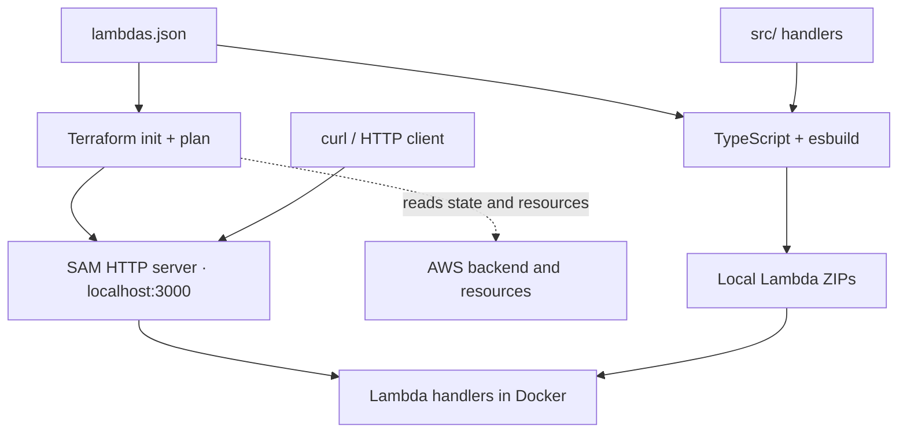

# Development

Build and run the Lambda HTTP endpoints locally. See [Testing](testing.md) for automated checks and [Deployment](deployment.md) for AWS releases.

## Requirements

| Requirement | Used for |
|---|---|
| Node.js 24 and npm | Building |
| [AWS SAM CLI](https://docs.aws.amazon.com/serverless-application-model/latest/developerguide/install-sam-cli.html) | Local execution; verified with SAM 1.167.0 and Node.js 24 |
| Docker with its daemon running | Lambda runtime containers |
| Terraform matching [the project constraint](../terraform/terraform.tf), Bash, and `zip` | API preparation and packaging |
| AWS credentials and network access | S3 state backend and deployed resources |

Only Node.js and npm are needed for `npm run build`.

## Setup

1. Install the tools above and start Docker.
2. Configure AWS access using the [deployment setup](deployment.md#setup).
3. From the repository root, install dependencies:

   ```bash
   npm ci
   ```

## How the local setup works

[`lambdas.json`](../lambdas.json) supplies the build and Terraform routes.
[`scripts/dev.sh`](../scripts/dev.sh) connects them through SAM's Terraform hook:



SAM runs with `--hook-name terraform` and `TF_VAR_lambdasVersion=local`.
It generates metadata from **init and plan, never apply**. No separate SAM
template is maintained.

## Run locally

Start the API from the repository root:

```bash
npm run dev
```

| Task | Command / action |
|---|---|
| Stop | Ctrl+C |
| Pick up code or registry changes | Stop and rerun `npm run dev` |
| Use another port | `npm run dev -- --port 3001` |
| Build without starting SAM | `npm run build` |

Use one server per checkout. The first invocation downloads the runtime image.

### Local limitations

- Handler SDK calls can reach AWS; other AWS services and IAM enforcement are not emulated.
- Undeployed resources may produce unresolved references. Review SAM's output and a Terraform plan before deploying. See [SAM's Terraform limitations](https://docs.aws.amazon.com/serverless-application-model/latest/developerguide/using-samcli-terraform.html).

## Build output

TypeScript checks types; esbuild bundles each handler and its dependencies into one minified CommonJS file. esbuild resolves the `tsconfig.json` path aliases, compiles decorators, and keeps class names so dependency injection errors stay readable.

| Artifact | Purpose |
|---|---|
| `dist/bundles/<name>/index.js` | Built handler; replaced on each build |
| `dist/<name>_local.zip` | Local SAM package; rebuilt by `npm run dev` |
| `dist/<name>_<version>.zip` | Deployment archive; preserved by local builds |
| `terraform/.aws-sam-iacs/` or `.aws-sam/` | Ignored SAM cache; version-dependent location |

Build code: [entry point](../build/index.mjs), [validation](../build/lambdas.mjs),
[bundler](../build/bundle.mjs), [configuration](../build/esbuild.config.mjs).

Node.js built-ins remain runtime imports. Native addons, runtime files, and
computed imports may need different packaging. The builder rejects extra output,
external non-built-in imports, and unsupported dynamic imports/`require` calls.
Imports with side effects may remain.
