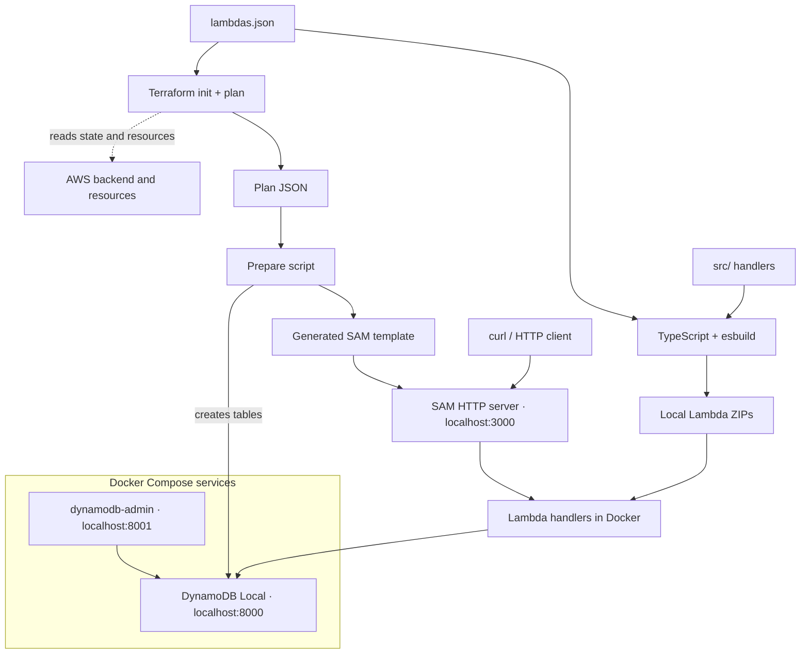

# Development

Build and run the Lambda HTTP endpoints locally against DynamoDB Local. See [Testing](testing.md) for automated checks and [Deployment](deployment.md) for AWS releases.

## Requirements

| Requirement | Used for |
|---|---|
| Node.js 24 and npm | Building |
| [AWS SAM CLI](https://docs.aws.amazon.com/serverless-application-model/latest/developerguide/install-sam-cli.html) | Local execution; verified with SAM 1.167.0 and Node.js 24 |
| Docker with its daemon running, and Docker Compose v2 | Lambda runtime containers, DynamoDB Local, and dynamodb-admin |
| Terraform matching [the project constraint](../terraform/terraform.tf), Bash, and `zip` | API preparation and packaging |
| AWS credentials and network access | S3 state backend, and AWS services other than DynamoDB |
| Free local ports 3000, 8000, and 8001 | The API, DynamoDB Local, and dynamodb-admin |

Only Node.js and npm are needed for `npm run build`.

## Setup

1. Install the tools above and start Docker.
2. Configure AWS access using the [deployment setup](deployment.md#setup).
3. From the repository root, install dependencies:

   ```bash
   npm ci
   ```

## How the local setup works

[`lambdas.json`](../lambdas.json) supplies the build and Terraform routes, and [`compose.dev.yaml`](../compose.dev.yaml) defines the local services. [`scripts/dev.sh`](../scripts/dev.sh) runs them from one Terraform plan:



1. The build packages each Lambda, and Docker Compose starts dynamodb-admin and an empty DynamoDB Local.
2. Terraform plans with `TF_VAR_lambdasVersion=local`, and `terraform show -json` exports the plan as JSON. The plan is **never applied**: it only serves as a machine-readable description of the tables, functions, and routes defined in `terraform/`.
3. A script reads the plan, creates its DynamoDB tables in DynamoDB Local, and generates a SAM template for its Lambdas and routes. See [Local tables](#local-tables) and [Local functions](#local-functions).
4. SAM runs the template's Lambdas in Docker, attached to the Compose network. The template is temporary, so no SAM template is maintained.

## Run locally

Start the API from the repository root:

```bash
npm run dev
```

| Task | Command / action |
|---|---|
| Stop the API | Ctrl+C; the Compose services keep running |
| Pick up code, registry, or table changes | Stop and rerun `npm run dev` |
| Use another port for the API | `npm run dev -- --port 3001` |
| Browse and edit items | Open <http://localhost:8001> |
| Deliver webhooks as the simulated gateways do | `npm run simulate` in another terminal; see [Simulated gateways](simulated-gateways.md#usage) |
| Use DynamoDB Local from the host | Add `--endpoint-url http://localhost:8000` to AWS CLI commands, such as `aws dynamodb scan --table-name webhook_events --endpoint-url http://localhost:8000` |
| Stop the Compose services | `docker compose -f compose.dev.yaml down` |
| Erase all local data | `docker compose -f compose.dev.yaml down --volumes` |
| Build without starting SAM | `npm run build` |

Use one server per checkout; checkouts on one machine share the Compose services. The first run downloads the runtime and service images.

### Local tables

| Behavior | Detail |
|---|---|
| Source | Every `aws_dynamodb_table` in the Terraform plan, so local tables follow `terraform/` without a copy of their definitions |
| Copied settings | Keys, attribute types, global and local secondary indexes, and TTL; capacity, backups, and other settings that do not change request behavior are left out |
| Missing table | Created |
| Table that matches its definition | Left untouched, with its items |
| Table whose keys, indexes, or TTL changed | Deleted and created again, which removes its items |
| Storage | A Docker volume, so items survive restarts until the local data is erased |
| Credentials and region | Shared: DynamoDB Local runs with `-sharedDb`, so the Lambdas, the AWS CLI, and dynamodb-admin see the same tables whatever access key or region they use |

Tables removed from Terraform stay in DynamoDB Local until its data is erased.

### Local functions

| Behavior | Detail |
|---|---|
| Source | Every `aws_lambda_function` and `aws_apigatewayv2_route` in the Terraform plan |
| Copied settings | Name, handler, runtime, memory, and timeout, plus the code: the function's bundle in `dist/bundles/`, which Terraform uploads zipped |
| Environment | The planned variables, including the [simulated gateways'](simulated-gateways.md#setup) secrets, local defaults unless set before `npm run dev` |
| Routes | Each route's method and path run the function with the same registry key; requests use payload format `2.0`, as deployed |
| Undeployed functions and routes | Run locally, because the template needs no deployed resource |
| DynamoDB endpoint | Every function gets `AWS_ENDPOINT_URL_DYNAMODB=http://dynamodb:8000`, so the AWS SDK sends DynamoDB requests to DynamoDB Local and the code needs no local-only configuration |

### Local limitations

- DynamoDB calls go to DynamoDB Local, which differs from the service in some behaviors, such as throughput limits; see the [DynamoDB Local usage notes](https://docs.aws.amazon.com/amazondynamodb/latest/developerguide/DynamoDBLocal.UsageNotes.html).
- Calls to other AWS services reach AWS. Other services and IAM enforcement are not emulated.
- Only the method and path of API Gateway routes apply locally; integration settings, such as the 30-second integration timeout, do not. A route without a method and path, such as `$default`, stops `npm run dev`.

## Build output

TypeScript checks types; esbuild bundles each handler and its dependencies, except the AWS SDK, into one minified CommonJS file. esbuild resolves the `tsconfig.json` path aliases, compiles decorators, and keeps class names so dependency injection errors stay readable.

| Artifact | Purpose |
|---|---|
| `dist/bundles/<name>/index.js` | Built handler; replaced on each build |
| `dist/<name>_local.zip` | Archive the local Terraform plan requires; rebuilt by `npm run dev` |
| `dist/<name>_<version>.zip` | Deployment archive; preserved by local builds |

Build code: [entry point](../build/index.mts), [validation](../build/lambdas.mts),
[bundler](../build/bundle.mts), [configuration](../build/esbuild.config.mts).

The build tooling is TypeScript that Node.js runs directly by stripping its types, with no compile step. [`build/tsconfig.json`](../build/tsconfig.json) type-checks it separately from the Lambda code and allows only syntax that Node.js can strip.

Node.js built-ins and AWS SDK v3 packages (`@aws-sdk/*`) remain runtime imports, because the Lambda Node.js runtime provides them; the SDK is a development dependency, used only for type checking and tests. The deployed SDK version is the one the runtime ships, so code must not rely on SDK features newer than it. Native addons, runtime files, and computed imports may need different packaging. The builder rejects extra output, any other external import, and unsupported dynamic imports/`require` calls. Imports with side effects may remain.
