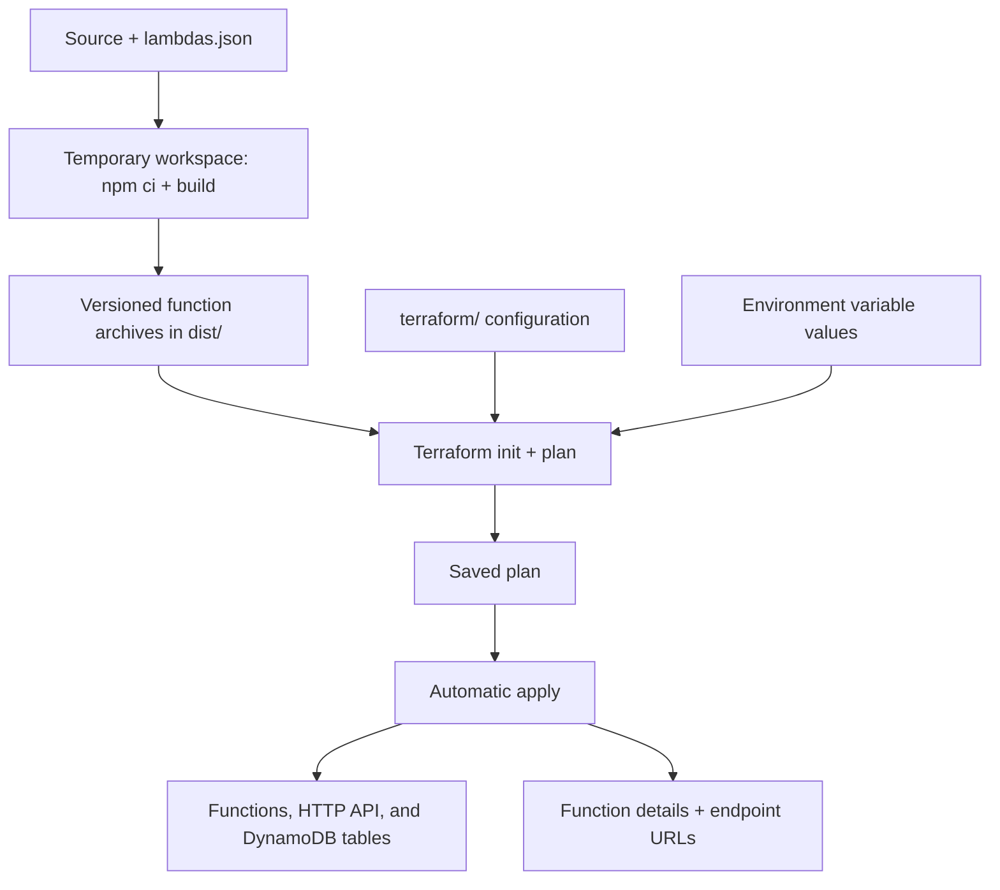

# Deployment

Build every registered function and deploy it to AWS, with its HTTP routes and the DynamoDB tables. See [Development](development.md) for local runs and [Testing](testing.md) for automated checks.

## Requirements

| Requirement | Used for |
|---|---|
| Node.js 24 and npm | Installing build tools and building the functions |
| Bash and `zip` | Running the deployment and packaging functions |
| Terraform matching the `required_version` in `terraform/` | Planning and applying infrastructure changes |
| AWS credentials and network access | Accessing the state backend and managing AWS resources |
| An existing S3 bucket for the state backend | Storing Terraform state |

## Setup

1. Install the tools above and configure credentials for the target AWS account.
2. Review the state backend, provider region, and resource names in the Terraform configuration in `terraform/`.
3. Ensure the backend bucket exists before initialization. The configuration also manages this bucket, so an existing bucket must be tracked in this Terraform state before applying.
4. Set the values of the functions' environment variables that Terraform declares without a default, such as provider credentials. Planning fails while one is missing, and Terraform state stores the values in plain text. Keep them: every deployment must use the same ones, and the [delivery simulator](simulated-gateways.md) needs them to reach a deployed API. Generate secrets with `openssl rand -hex 32`.

   | Option | How |
   |---|---|
   | Secrets file | Copy [`terraform/secrets.auto.tfvars.example`](../../terraform/secrets.auto.tfvars.example) to `terraform/secrets.auto.tfvars` and fill it in; Terraform loads it automatically, and git ignores it |
   | Environment | Export each variable as `TF_VAR_<NAME>`; a secrets file takes precedence |

## How it works

`npm run deploy` builds in a temporary workspace and uses [`lambdas.json`](../../lambdas.json) to select the functions:



**The entire saved plan is applied automatically**, including infrastructure changes beyond function code. The deployment does not pause for review or run the tests.

| Artifact | Behavior |
|---|---|
| `dist/<name>_<version>.zip` | One archive per function containing `index.js`; kept after deployment |
| Version suffix | UTC timestamp plus a unique suffix, passed as `lambdasVersion` |
| Temporary workspace and saved plan | Removed when the deployment ends, including on failure |
| Existing local dependencies and bundles | Preserved |

## Usage

Run the [automated checks](testing.md), then deploy from the repository root:

```bash
npm run deploy
```

To review the infrastructure changes first, run `terraform -chdir=terraform plan -var=lambdasVersion=local` after `npm run dev` has packaged the local archives. The deployment stops on the first failure; inspect a fresh plan before retrying a failed infrastructure change.

### Deployed resources

| Resource | Details |
|---|---|
| Functions | One Node.js 24 Lambda per registry entry, running `index.handler` with the IAM role its entry selects; see [Adding a Lambda](adding-a-lambda.md) |
| Environment variables | Per function, from the values set during setup |
| HTTP API | API Gateway HTTP API with an automatically deployed `$default` stage, and one route, proxy integration, and invocation permission per function |
| DynamoDB tables | On-demand tables with their indexes and TTL; see the [data model](../architecture/data-model/) |
| State bucket | The S3 bucket holding the Terraform state, managed by the same configuration |

Terraform uploads each archive directly to Lambda and tracks its content hash, so only changed functions are updated.

### Calling the API

Inspect the deployed URLs and functions:

```bash
terraform -chdir=terraform output lambda_endpoints
terraform -chdir=terraform output lambda_functions
terraform -chdir=terraform output -raw api_endpoint
```

Call each route with the method and path registered in `lambdas.json`, substituting any path parameters. URLs have no stage prefix.

| API behavior | Current configuration |
|---|---|
| Authentication | None at API Gateway; a function that needs it authenticates requests itself, as [webhook receipt](../architecture/webhook-receipt.md) does |
| Event format | API Gateway payload `2.0` |
| Integration timeout | 30 seconds, even if the function timeout is longer |
| Unmatched route | HTTP 404 |

Functions must respond within the integration timeout; longer work needs asynchronous processing. Other event sources and service permissions need additional configuration.
