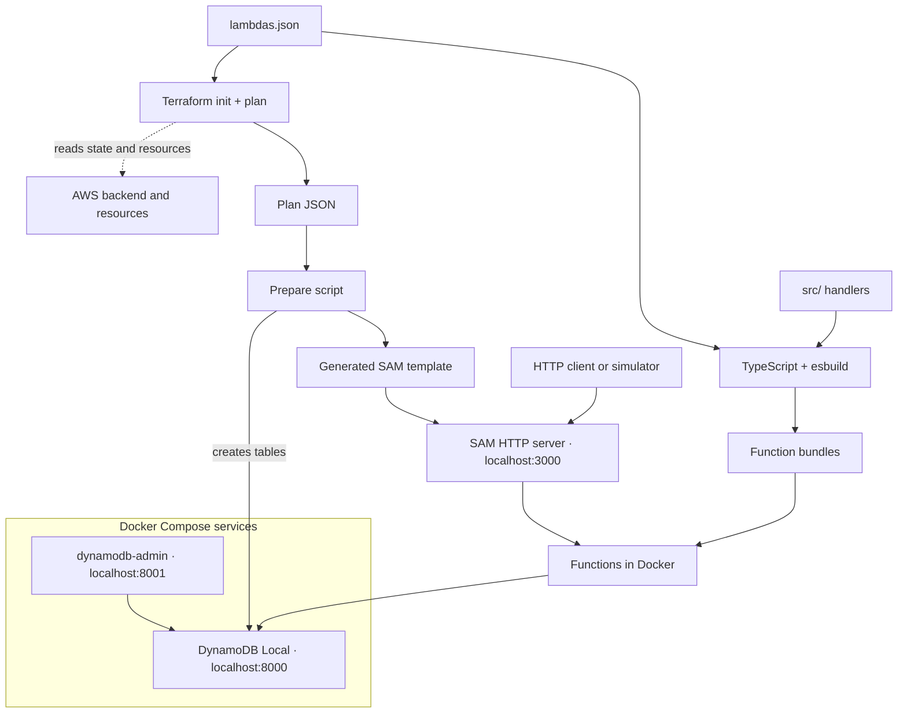

# Development

Run the API and its database on your machine, from the same Terraform definitions that deploy them. See [Testing](testing.md) for automated checks and [Deployment](deployment.md) for releases to AWS.

## Requirements

| Requirement | Used for |
|---|---|
| Node.js 24 and npm | Building |
| [AWS SAM CLI](https://docs.aws.amazon.com/serverless-application-model/latest/developerguide/install-sam-cli.html) | Running the functions; verified with SAM 1.167.0 |
| Docker with its daemon running, and Docker Compose v2 | Function containers and the local services |
| Terraform matching the `required_version` in `terraform/`, Bash, and `zip` | Planning and packaging |
| AWS credentials and network access | Reading the Terraform state, and AWS services that are not emulated locally |
| Free local ports 3000, 8000, and 8001 | The API, DynamoDB Local, and dynamodb-admin |

Building and testing need only Node.js and npm.

## Setup

1. Install the tools above and start Docker.
2. Configure AWS access as in the [deployment setup](deployment.md#setup). Local runs read the Terraform state but never change AWS resources.
3. Install the dependencies from the repository root:

   ```bash
   npm ci
   ```

## How it works

[`lambdas.json`](../../lambdas.json) registers the functions and their routes, and [`compose.dev.yaml`](../../compose.dev.yaml) defines the local services. `npm run dev` runs both from one Terraform plan:



1. The build bundles each function, and Docker Compose starts dynamodb-admin and an empty DynamoDB Local.
2. Terraform plans with local archive names and local secrets, and exports the plan as JSON. The plan is **never applied**: it only serves as a machine-readable description of the tables, functions, and routes defined in `terraform/`.
3. A script creates the planned tables in DynamoDB Local and generates a SAM template for the planned functions and routes. See [Local tables](#local-tables) and [Local functions](#local-functions).
4. SAM serves the routes and runs each request's function in a container attached to the Compose network. The template is temporary, so no SAM template is maintained.

## Usage

Start the API from the repository root:

```bash
npm run dev
```

| Task | Command or action |
|---|---|
| Stop the API | Ctrl+C; the local services keep running |
| Pick up code, registry, or table changes | Stop and rerun `npm run dev` |
| Serve the API on another port | `npm run dev -- --port 3001` |
| Browse and edit items | Open <http://localhost:8001> |
| Replay the delivery scenarios | `npm run simulate` in another terminal; see [Simulated gateways](simulated-gateways.md#usage) |
| Query DynamoDB Local from the host | Add `--endpoint-url http://localhost:8000` to AWS CLI commands, such as `aws dynamodb scan --table-name <table> --endpoint-url http://localhost:8000` |
| Stop the local services | `docker compose -f compose.dev.yaml down` |
| Erase all local data | `docker compose -f compose.dev.yaml down --volumes` |
| Build without starting the API | `npm run build` |

Run one API per checkout; checkouts on one machine share the local services. The first run downloads the function runtime and service images.

### Local tables

| Behavior | Detail |
|---|---|
| Source | Every `aws_dynamodb_table` in the Terraform plan, so local tables follow `terraform/` without a copy of their definitions |
| Copied settings | Keys, attribute types, global and local secondary indexes, and TTL; capacity, backups, and other settings that do not change request behavior are left out |
| Missing table | Created |
| Table that matches its definition | Left untouched, with its items |
| Table whose keys, indexes, or TTL changed | Deleted and created again, which removes its items |
| Storage | A Docker volume, so items survive restarts until the local data is erased |
| Credentials and region | Shared: DynamoDB Local runs with `-sharedDb`, so the functions, the AWS CLI, and dynamodb-admin see the same tables whatever access key or region they use |

Tables removed from Terraform stay in DynamoDB Local until its data is erased.

### Local functions

| Behavior | Detail |
|---|---|
| Source | Every `aws_lambda_function` and `aws_apigatewayv2_route` in the Terraform plan |
| Copied settings | Name, handler, runtime, memory, timeout, and environment variables; the code is the function's bundle in `dist/bundles/`, which Terraform uploads zipped |
| Routes | Each route's method and path run the function with the same registry key, with payload format `2.0`, as deployed |
| Undeployed functions and routes | Run locally, because nothing in the template depends on deployed resources |
| Secrets | Local values for the secrets `npm run dev` knows, such as the [simulated gateways'](simulated-gateways.md#setup), unless set before it runs; the deployment secrets file never applies locally |
| DynamoDB endpoint | Every function gets `AWS_ENDPOINT_URL_DYNAMODB`, so the AWS SDK sends DynamoDB requests to DynamoDB Local and the code needs no local-only configuration |

### Local limitations

- DynamoDB Local differs from the service in some behaviors, such as throughput limits; see the [DynamoDB Local usage notes](https://docs.aws.amazon.com/amazondynamodb/latest/developerguide/DynamoDBLocal.UsageNotes.html).
- Calls to other AWS services reach AWS. Other services and IAM permissions are not emulated.
- Only the method and path of API Gateway routes apply locally; integration settings, such as the 30-second integration timeout, do not. A route without a method and path, such as `$default`, stops `npm run dev`.
- An environment variable that has no default and no local value, such as a new secret, must be exported as `TF_VAR_<NAME>` before `npm run dev`.

## Build output

TypeScript checks types, and esbuild bundles each function and its dependencies, except the AWS SDK, into one minified CommonJS file. esbuild resolves the `tsconfig.json` path aliases, compiles decorators, and keeps class names so dependency injection errors stay readable.

| Artifact | Purpose |
|---|---|
| `dist/bundles/<name>/index.js` | Built function; replaced on each build |
| `dist/<name>_local.zip` | Archive the local Terraform plan requires; rebuilt by `npm run dev` |
| `dist/<name>_<version>.zip` | Deployment archive; preserved by local builds |

The build tooling in `build/` and the scripts in `scripts/` are TypeScript that Node.js runs directly by stripping its types, with no compile step. `build/tsconfig.json` type-checks the build tooling separately from the function code and allows only syntax that Node.js can strip.

Node.js built-ins and AWS SDK v3 packages (`@aws-sdk/*`) remain runtime imports, because the Lambda Node.js runtime provides them; the SDK is a development dependency, used only for type checking and tests. The deployed SDK version is the one the runtime ships, so code must not rely on SDK features newer than it. The builder rejects extra output, any other external import, and unsupported dynamic imports or `require` calls. Native addons, runtime files, and computed imports may need different packaging.
