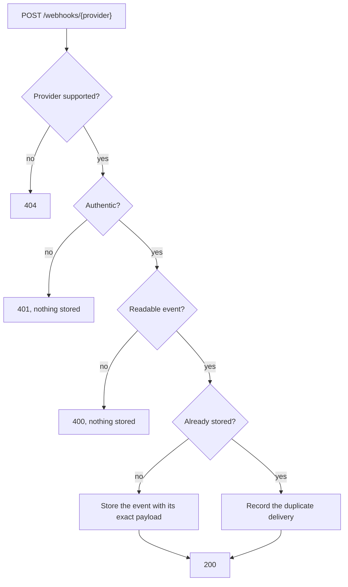

# Receiving webhooks

One function, `webhook_entry_point`, receives webhooks from every payment provider at `POST /webhooks/{provider}`. The `{provider}` path segment selects the provider adapter that authenticates the request and reads its event, and the event is then stored once in the [webhook events table](data-model/webhook-events.md). Receipt applies no business effects.

## How it works

- The provider name is matched exactly, so `/webhooks/stripe` selects the adapter named `stripe`.
- Nothing from an unauthenticated request is parsed or stored.
- The stored event keeps the body exactly as received, so it can be audited and reprocessed.
- A repeated delivery is acknowledged like a new one, because providers keep retrying until they receive a 2xx response.

## Responses

| Status | Error code | Category | Kind | When |
|---|---|---|---|---|
| 200 | | | | The event was stored, or a repeated delivery was recorded; the body is `{ "provider", "providerEventId", "duplicate" }` |
| 400 | `BAD_REQUEST` | `http` | Expected | The body is not valid JSON |
| 400 | `MALFORMED_WEBHOOK_EVENT` | `webhooks` | Unexpected | The request is authentic, but its body is not an event the provider sends, so its adapter likely needs updating |
| 401 | `WEBHOOK_AUTHENTICATION_FAILED` | `webhooks` | Expected | The request does not prove it comes from the provider in its URL |
| 404 | `WEBHOOK_PROVIDER_NOT_FOUND` | `webhooks` | Expected | The URL names a provider this deployment does not support |
| 500 | `INTERNAL_SERVER_ERROR` | | Unexpected | A failure the application does not define, such as storage being unavailable; the provider retries |

Errors use the response shape and log fields described in [Errors](architecture.md#errors). An expected error can still signal trouble in volume: a sudden rise in `WEBHOOK_AUTHENTICATION_FAILED` may mean a rotated signing secret, not forged requests.

## Adding a provider

1. Implement the `WebhookProvider` port in `src/infra/webhooks/<provider>/` with `@Injectable(...)`. Its `name` is the URL segment, such as `stripe`.
2. In `authenticate`, check the provider's signature or credentials against `rawBody`, the body exactly as received.
3. In `parse`, return the provider's event ID, event type, occurrence time, and subject, or `undefined` when the body is not one of the provider's events.
4. List the adapter in the `@Injectable` decorator of `InMemoryWebhookProviderCatalog`.
5. Add tests next to the adapter. See [Testing](testing.md#writing-tests).

Adding a provider changes no business rule, route, or Terraform configuration.

## Limitations

- No provider adapter exists yet, so every provider is answered with 404.
- Bodies must be JSON; other formats are rejected with 400 before reaching the provider adapter.
